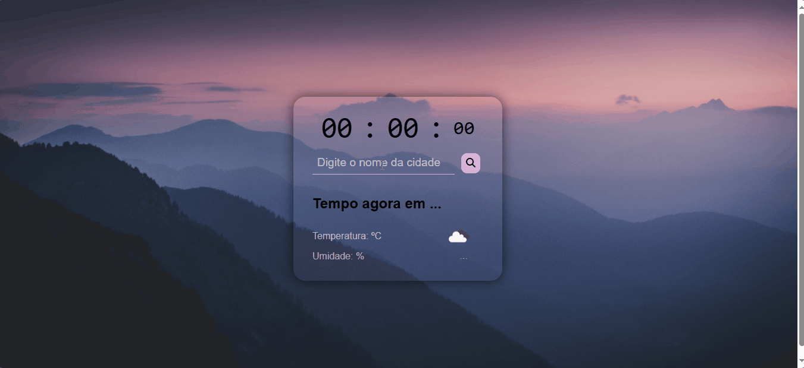

# previsao-tempo
Previsão do tempo com javascript, Open Weather Api e design responsivo.

# Previsão do tempo com Javascript

 

# Índice

* [Descrição do projeto](#descrição-do-projeto)
* [Funcionalidades e Demonstração da Aplicação](#funcionalidades-e-demonstração-da-aplicação)
* [Tecnologias utilizadas](#tecnologias-utilizadas)
* [Pessoas Desenvolvedoras do Projeto](#pessoas-desenvolvedoras)
 

# Descrição do projeto

Sistema desenvolvido com objetivo de praticar front end, utilizando integração com Open Weather Api, Javascript e responsividade.
  

# Funcionalidades e Demonstração da Aplicação

* Funcionalidade 1: Mostrar horário na tela do usuário.
* Funcionalidade 2: Buscar clima em determina cidade do mundo. 
* Funcionalidade 2: Mostrar informações atuais do clima para o usuario. 
 

 
# Tecnologias utilizadas 

- ``Javascript``
- ``Html``
- ``Css``
 

# Pessoas Desenvolvedoras do Projeto

https://github.com/lucasbarsaglini

